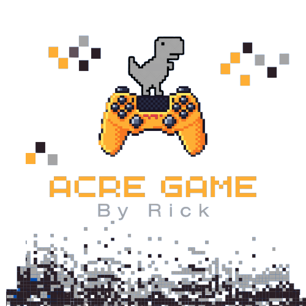

  
# Jogo dinossauro google
  
<h4>Criei o jogo do dinossauro do google de um jeito diferente. Utilizando JavaScript, HTML e CSS. Fiz isso para me aprofundar em scripts do JS e em keyframes do css.</h4>
  

  

<!-- Image Shields -->

</a>

### 👨🏻‍💻 Technologies

 &nbsp;
 &nbsp;
 &nbsp;

### 👻 Results

<a href="https://rickferreira.github.io/Jogo-Dinossauro-Google/">-----------------Click aqui para jogar-----------------</a>

  

<table>
  <tr>
    <td align="center">
      <a href="https://github.com/RickFerreira">
         
        
          <b>Autor: Richard Ferreira</b>
        
      </a>
    </td>
  </tr>
</table>

[☝🏽 Voltar ao topo](#Jogo-dinossauro-google) 

